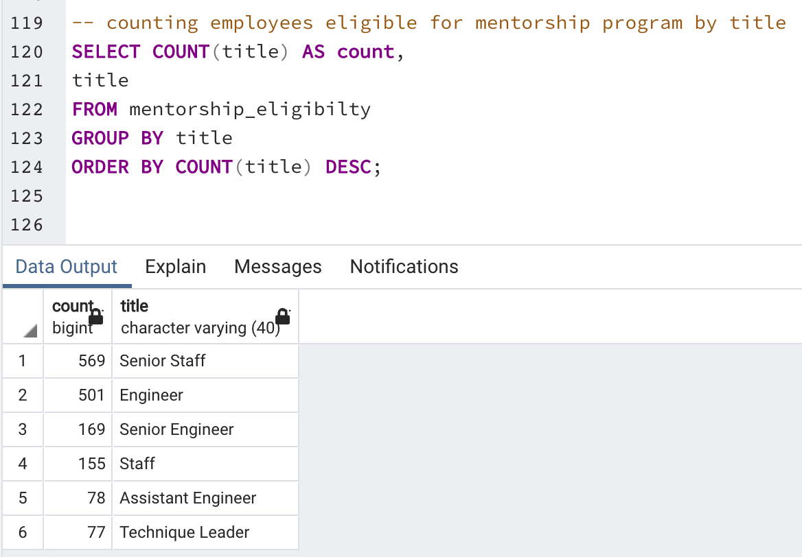

# Pewlett-Hackard-Analysis

## Overview of the analysis
Pewlett Hackard is a large company boasting several thousand employees and it has been around for a long time. As baby boomers begins to retire at a rapid rate, thus will leave thousands of job openings. Pewlett Hackard is looking ahead by offering retirement package for those who meet certain criteria and starting to think about which position will need to be filled in the near future.

The employee data we are using is only available in the form of six CSV files, because Pewlett Hackard has been mainly using Excel and VBA to work with their data. But now they've finally decided to update their methods and instead use SQL, a definite upgrade considering the amount of data. We will first build an employee database with SQL, then generate a list of all employees eligible for the retirement package. After that, we will determine the number of retiring employees per title, and identify employees who are eligible to participate in a mentorship program. Fianlly, a report that summarizes the analysis will be presented.  
## Results

* List of Retiring Employees

A list of current employees who are born between January 1, 1952 and December 31, 1955 with most recent job title are retrieved as below.

* The Number of Retiring Employees by Title

There are 72,458 employees in total going to retire, with breakdown as follows. It is clear that there will be 25,916 and 24,926 upcoming vacancies in the position of Senior Engineering and senior staff respectively. Thus, it is suggested Pewlett Hackard to put effort to fill these roles on priority. While there are only two managers going to retire, it is not an urgent position in recruiting project. 

 * Employees who are eligible to participate in a mentorship program

There are 1,549 employees eligible for the mentorship program, a list sorted by employee id is shown as follows:

 

## Summary

There are 72,458 employees in total going to retire, and 1,549 employees are eligible for the mentorship program. It is clear that the mentors are way less than the upcoming vancancies. 

To determine how many mentees for each mentor, we can draw a table of employees eligible for the mentorship program by title as follows:

 

 Take senior engineer as an example, there are 25,916 upcoming vancancies, and currently there are 169 eligible mentors, on average one mentor for 154 mentees. It is a bit unrealitic. Thus, it is suggested Pewlett Hackard to either expand the eligible critria of mentor to increase the number of mentors, or fill those positions in different phrase.

 In order to have a better understand of retirement and mentor distribution, two additional tables are drawn by departments.
 
 * Number of employees who are going to retire by department:

 

 * Number of employees who eligible for mentorship program by department:

 

 From the above tables, there are three departments (development, production and sales) having the most retiring employees, while they have relatively more elegible mentors. The average rate of mentor per upcoming vancancies is roughly 50 to 1. It is again suggesting Pewlett Hackard to either expand the eligible critria of mentor to increase the number of mentors, or start the recruitment earlier in order to fill those positions in different phrase.

